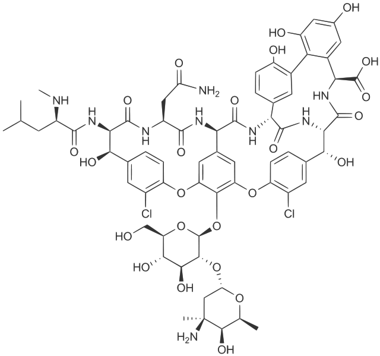

# Vancomycin-Model
Whole-body PBPK model of Vancomycin 

  

## Repository files

Within this repository, we distribute a whole-body PBPK model of  Vancomycin, that has been developed using clinical studies in adults and evaluated for its predictive performance of GFR mediated clearance in children. 

The PK-Sim project file contains simulations of all published  clinical studies employed during model establishment ([[1-2](#reference)]) and for model predictions in pediatrics ([[4](#reference)]), including the respective observed data digitized.

## Code of conduct

Everyone interacting in the Open Systems Pharmacology community  (codebases, issue trackers, chat rooms, mailing lists etc...) is  expected to follow the Open Systems Pharmacology [code of conduct](https://github.com/Open-Systems-Pharmacology/Suite/blob/master/CODE_OF_CONDUCT.md#contributor-covenant-code-of-conduct).

## Contribution

We encourage contribution to the Open Systems Pharmacology community. Before getting started please read the [contribution guidelines](https://github.com/Open-Systems-Pharmacology/Suite/blob/master/CONTRIBUTING.md#ways-to-contribute). If you are contributing code, please be familiar with the [coding standard](https://github.com/Open-Systems-Pharmacology/Suite/blob/master/CODING_STANDARDS.md#visual-studio-settings).

## License

The model code is distributed under the [GPLv2 License](https://github.com/Open-Systems-Pharmacology/Suite/blob/develop/LICENSE).

## References

[1] [Boeckh M, Lode H, Borner K, Höffken G, Wagner J, Koeppe P. Pharmacokinetics and serum bactericidal activity of vancomycin alone and in combination with ceftazidime in healthy volunteers. Antimicrob Agents Chemother. 1988 Jan;32(1):92-5.](https://aac.asm.org/content/32/1/92.long)

[2] [Healy DP, Polk RE, Garson ML, Rock DT, Comstock TJ. Comparison of steady-state pharmacokinetics of two dosage regimens of vancomycin in normal volunteers. Antimicrob Agents Chemother. 1987 Mar;31(3):393-7.](https://aac.asm.org/content/31/3/393.long)

[3] [Schaad UB, McCracken GH Jr, Nelson JD. Clinical pharmacology and efficacy of vancomycin in pediatric patients. J Pediatr. 1980 Jan;96(1):119-26.](https://www.sciencedirect.com/science/article/pii/S0022347680803477?via%3Dihub)

